# Smart-Irrigation-System-Using-IOT-Based-On-Temperature-And-Moisture-In-Soil

<h2>Introduction</h2>
<!DOCTYPE html>
<html lang="en">
<head>
  <meta charset="UTF-8" />
  <meta name="viewport" content="width=device-width, initial-scale=1" />
  <title>Smart Irrigation System Project Summary</title>
  
</head>
<body>

  <h2>Thanks for sharing your <strong>Smart Irrigation System using IoT based on Temperature and Soil Moisture</strong> project!</h2>
  
It’s a great use case of IoT for agriculture, and I see you’ve integrated hardware (NodeMCU, DHT11, soil moisture sensor, relay) with a cloud backend and Android app control. Here’s a summary and some suggestions to polish your project and maybe improve clarity if you want to present it or document it:

  

  <h3>Summary of Your Project</h3>
  
<strong>Goal:</strong> 
  Automate irrigation by monitoring soil moisture and temperature, allowing remote control of the water pump via an Android app.

  

  <h3>How It Works</h3>
  <ul>
    <li><strong>Sensors:</strong>
      <ul>
        <li>Soil moisture sensor reads moisture levels.</li>
        <li>DHT11 sensor reads temperature and humidity.</li>
      </ul>
    </li>
    <li><strong>Microcontroller:</strong>
      <ul>
        <li>NodeMCU (ESP8266) reads sensor data.</li>
        <li>Sends data to a remote database hosted on either <code>000webhostapp.com</code> or Google Sheets via Google Script API.</li>
        <li>Controls a relay to switch the water pump ON/OFF.</li>
      </ul>
    </li>
    <li><strong>Backend:</strong>
      <ul>
        <li>PHP API on <code>000webhostapp.com</code> handles data storage for motor and weather info.</li>
        <li>Google Apps Script API is used to get motor control status.</li>
      </ul>
    </li>
    <li><strong>Android App:</strong>
      <ul>
        <li>Displays current moisture and temperature data fetched from server.</li>
        <li>Allows manual control of the water pump (ON/OFF) via buttons.</li>
        <li>Uses Volley for network requests and WaveLoadingView for UI progress animation.</li>
      </ul>
    </li>
  </ul>

  

  <h3>Key Components &amp; Connections</h3>
  
<strong>NodeMCU Pins:</strong>

  <ul>
    <li>DHT11 signal → D3 (GPIO 0)</li>
    <li>Moisture sensor A0 → A0 (analog input)</li>
    <li>Relay signal → D1 (GPIO 5)</li>
    <li>Power and GND connections accordingly</li>
  </ul>

  

  <h3>Code Highlights</h3>
  <ul>
    <li>Arduino code reads sensors, posts data to PHP API, polls Google Script for motor status, and turns relay ON/OFF.</li>
    <li>Android app requests sensor data via JSON and updates UI every second.</li>
    <li>Android app sends motor ON/OFF commands via GET requests to Google Script API.</li>
  </ul>

  

  <h3>Suggestions &amp; Improvements</h3>
  <ol>
    <li><strong>Consistent Backend Hosting</strong> 
    Since you have two hosts (<code>000webhostapp.com</code> and Google Script), consider consolidating APIs to a single host for easier maintenance.</li>
    <li><strong>Security</strong>
      <ul>
        <li>Use HTTPS for all API calls.</li>
        <li>Add authentication to your PHP and Google Script APIs to prevent unauthorized access.</li>
      </ul>
    </li>
    <li><strong>Code Modularization</strong> 
    Separate Arduino code functions for sensor reading, posting data, and motor control for better readability. 
    Add comments explaining logic blocks clearly.</li>
    <li><strong>Android App UX</strong>
      <ul>
        <li>Add error handling for network failures or sensor read errors.</li>
        <li>Add real-time updates with periodic polling or push notifications.</li>
      </ul>
    </li>
    <li><strong>Threshold Automation</strong> 
    Besides manual pump control, consider automatic ON/OFF based on moisture threshold to reduce user intervention.</li>
    <li><strong>Data Visualization</strong> 
    Store historic sensor data and display graphs on the Android app for trends and better farming decisions.</li>
    <li><strong>Power Management</strong> 
    Add low power modes in NodeMCU to optimize battery life if needed.</li>
  </ol>

  

  <h3>Sample Explanation Snippet You Can Use in Report or Presentation</h3>
  <blockquote style="font-style: italic; border-left: 4px solid #ccc; padding-left: 10px; color: #555;">
    
<strong>Smart Irrigation System Using IoT</strong> is designed to optimize water usage in agriculture by continuously monitoring soil moisture and temperature conditions. Using NodeMCU ESP8266, data from the soil moisture sensor and DHT11 temperature sensor is collected and sent to a remote server. Farmers can remotely monitor the soil environment and control the water pump through an Android application, improving water efficiency and crop yield.

  </blockquote>

  

<h2>Diagram</h2>
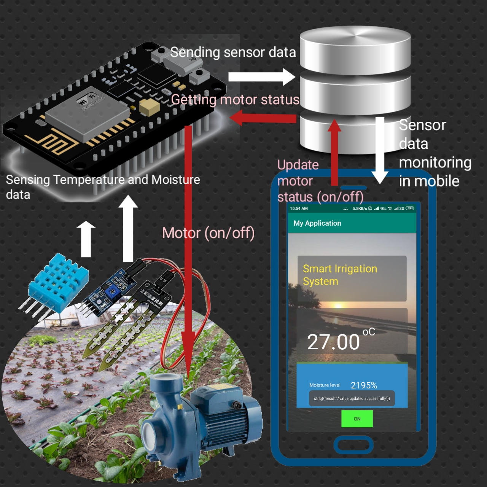

<h2>Abstract</h2>
<h2>Existing System</h2>

Automatic Plant Watering System Using Arduino Uno

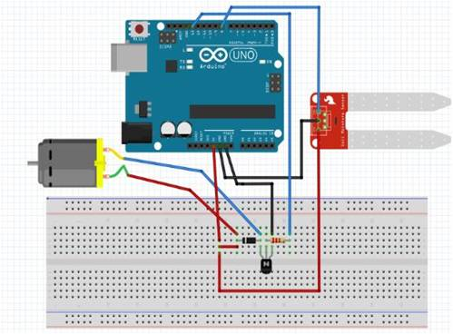
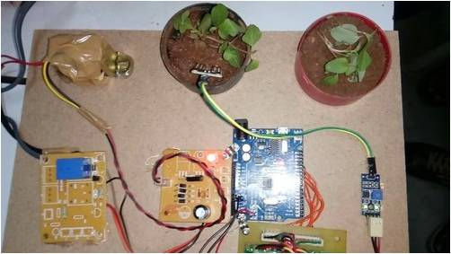

<h2>Proposed System</h2>
<h3><a href="#psystem">Smart-Irrigation-System-Using-IOT-Based-On-Temperature-And-Moisture-In-Soil</a></h3>

<h2>Requirements</h2>
<ul>
  <li>Nodemcu (WiFiModule ESP8266)</li>
  <li>DHT11</li>
  <li>Soil Moisture Meter</li>
  <li>Relay</li>  
  <li>Database</li>
  <li>Android Studio</li>
  <li>Water motor</li>
</ul>

<h2>Database Tables</h2>
<h3>Motor Table</h3>

motor_table with two attributes id and status

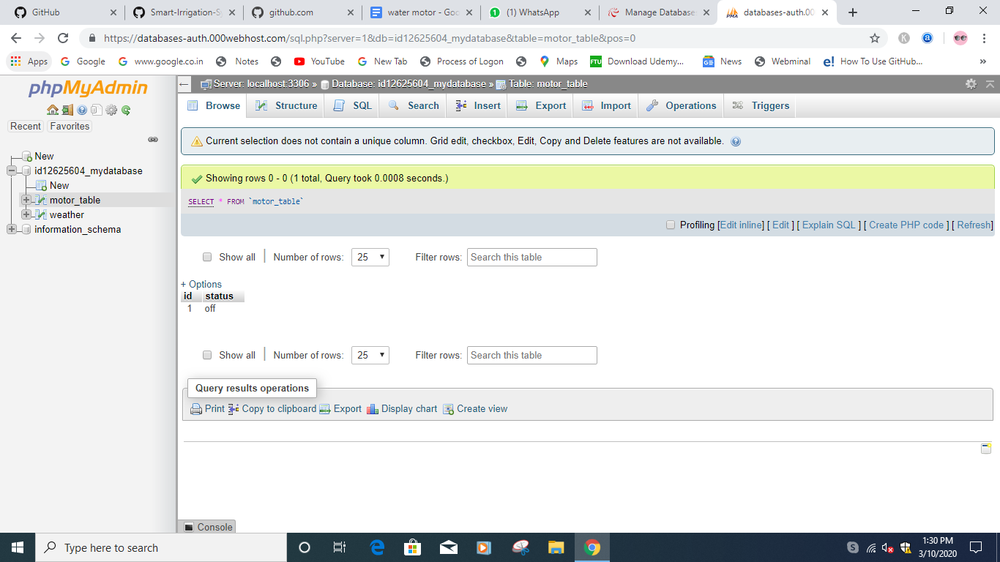
<h3>Weather Table</h3>

weather table with id, temp, hum and mois attributes

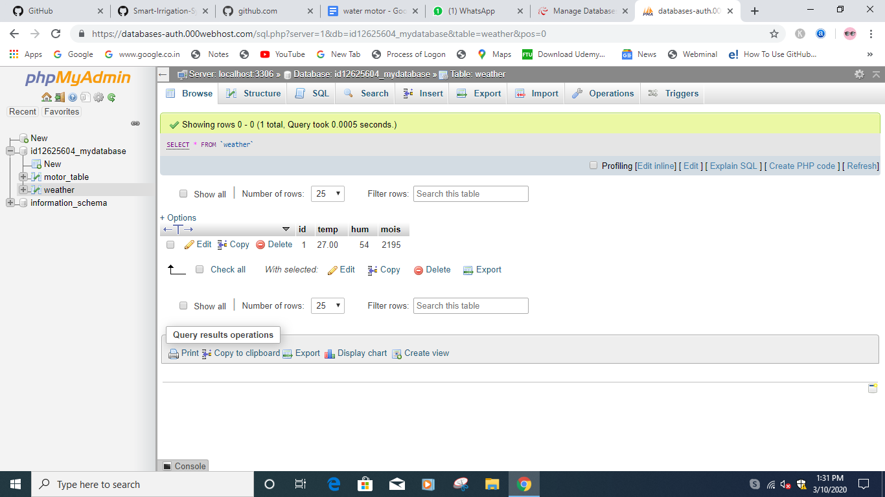

<h2>Uploading Php api files into file directorty in server</h2>

Create two folders one for motor_table and another for weather table and then upload api files.

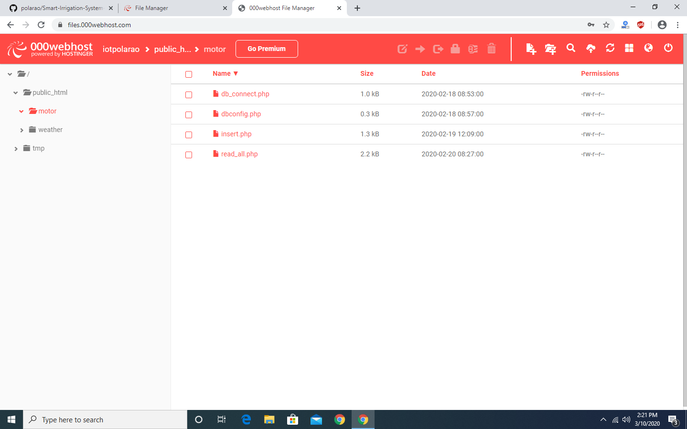
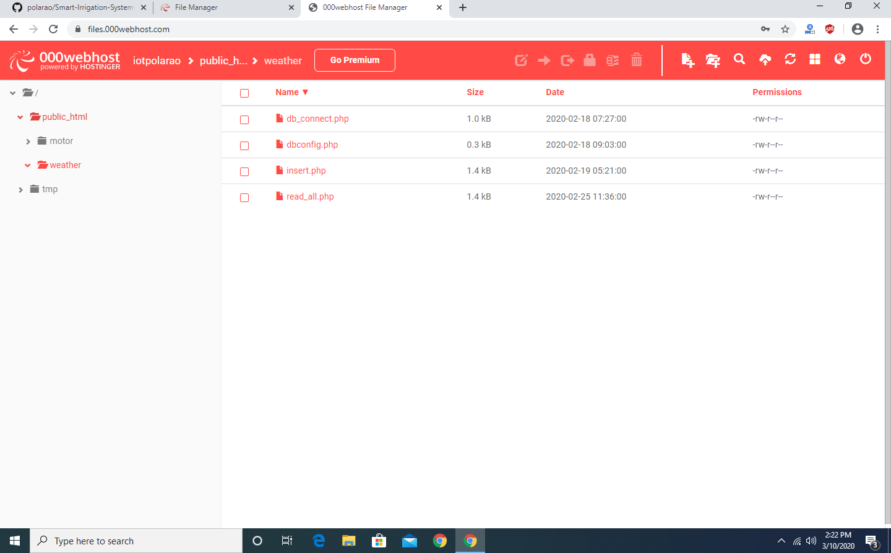

<h3>Copy APIs links of weather and motor php files past into android java code and arduino code for sending recieving data from datrabase</h3>
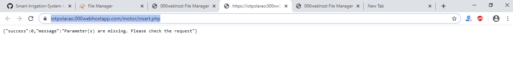
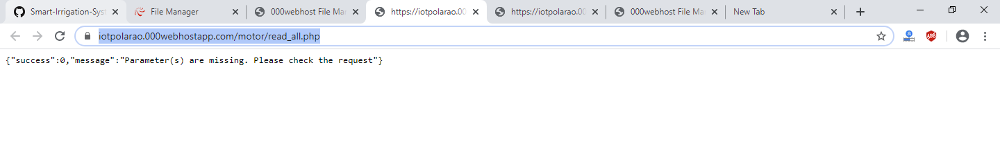
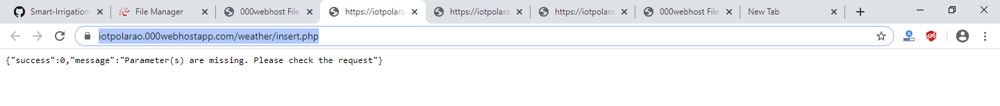
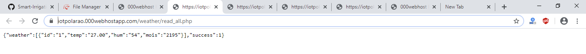

<h2>Connections for Nodemcu and Sensors</h2> 

According to your requirement you can change pins in nodemcu(WiFiModule ESP8266)
 
<h3>Connections between Nodemcu and DHT11</h3> 
DHT11 +terminal connect to Nodemcu 3v pin 
DHT11 -terminal connect to Nodemcu GND pin 
DHT11 signal terminal connect to Nodemcu D3/0 pin 
<h3>Connections between Nodemcu and Moisture sensor</h3> 
Moisture sensor GND terminal connect to Nodemcu GND pin 
Moisture sensor VCC terminal connect to Nodemcu 3v pin 
Moisture sensor A0 terminal connect to Nodemcu A0 analog pin 
<h3>Connections between Nodemcu and Relay</h3> 
Realy +terminal connect to 3v pin of Nodemcu 
Realy -terminal connect to GND pin of Nodemcu 
Realy signal terminal connect to D1 pin in Nodemcu 
<h2>Arduino Programming</h2> 
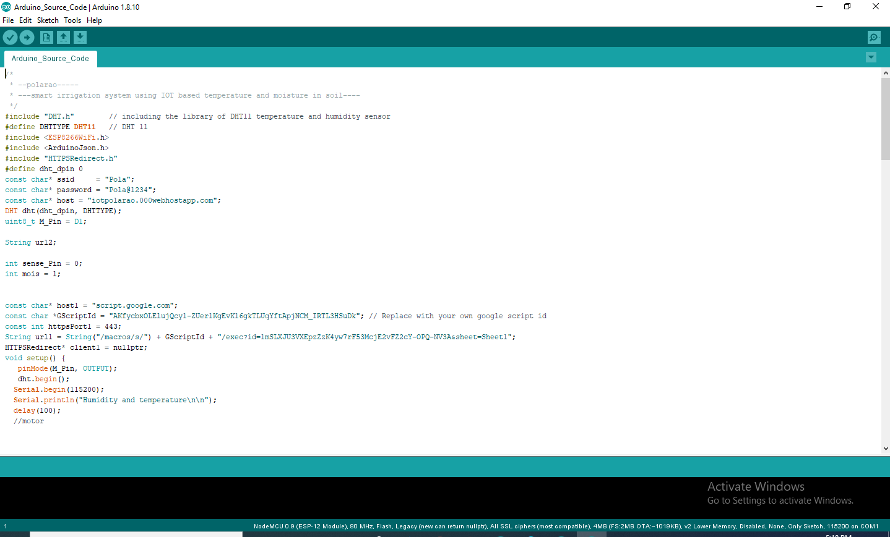 

  <pre>
  /*
 * --polarao-----
 * ---smart irrigation system using IOT based temperature and moisture in soil----
 */
/*
 * --polarao-----
 * ---smart irrigation system using IOT based temperature and moisture in soil----
 * static const uint8_t D0   = 16;
static const uint8_t D1   = 5;
static const uint8_t D2   = 4;
static const uint8_t D3   = 0;
static const uint8_t D4   = 2;
static const uint8_t D5   = 14;
static const uint8_t D6   = 12;
static const uint8_t D7   = 13;
static const uint8_t D8   = 15;
static const uint8_t D9   = 3;
static const uint8_t D10  = 1;
 */
#include "DHT.h"        // including the library of DHT11 temperature and humidity sensor
#define DHTTYPE DHT11   // DHT 11
#include <ESP8266WiFi.h>
#include <ArduinoJson.h>
#include "HTTPSRedirect.h"
#define dht_dpin 0//D3
const char* ssid     = "Pola";
const char* password = "Pola@1234";
const char* host = "iotpolarao.000webhostapp.com";
DHT dht(dht_dpin, DHTTYPE); 
uint8_t M_Pin = D1;//5

String url2;

int sense_Pin = A0;
int mois = 1;

const char* host1 = "script.google.com";
const char *GScriptId = "AKfycbxOLElujQcy1-ZUer1KgEvK16gkTLUqYftApjNCM_IRTL3HSuDk"; // Replace with your own google script id
const int httpsPort1 = 443; 
String url1 = String("/macros/s/") + GScriptId + "/exec?id=1mSLXJU3VXEpzZzK4yw7rF53McjE2vFZ2cY-OPQ-NV3A&sheet=Sheet1";
HTTPSRedirect* client1 = nullptr;
void setup() {
   pinMode(M_Pin, OUTPUT);
   dht.begin();
  Serial.begin(115200);
  Serial.println("Humidity and temperature\n\n");
  delay(100);
  //motor
 

  
  // We start by connecting to a WiFi network

  Serial.println();
  Serial.println();
  Serial.print("Connecting to ");
  Serial.println(ssid);
  
  WiFi.begin(ssid, password);
  
  while (WiFi.status() != WL_CONNECTED) {
    delay(500);
    Serial.print(".");
  }

  Serial.println("");
  Serial.println("WiFi connected");  
  Serial.println("IP address: ");
  Serial.println(WiFi.localIP());
  Serial.print("Netmask: ");
  Serial.println(WiFi.subnetMask());
  Serial.print("Gateway: ");
  Serial.println(WiFi.gatewayIP());

  //motor
digitalWrite(M_Pin, 0);

 client1 = new HTTPSRedirect(httpsPort1);
client1->setInsecure();
client1->setPrintResponseBody(true);
client1->setContentTypeHeader("application/json");
Serial.print("Connecting to ");
Serial.println(host1); 
}

int value = 0;

void loop() {
  
  delay(500);
  ++value;

   Serial.print("MOISTURE LEVEL : ");
   mois= analogRead(sense_Pin);
   mois= mois;
   Serial.println(mois);

  Serial.print("connecting to ");
  Serial.println(host);
  
  // Use WiFiClient class to create TCP connections
  WiFiClient client;
  const int httpPort = 80;
  if (!client.connect(host, httpPort)) {
    Serial.println("connection failed");
    return;
  }
  float h=1;
  float t=1;
   h = dht.readHumidity();
    t = dht.readTemperature();
    
   //posting data to server start
  // We now create a URI for the request
  String url = "/weather/insert.php";
 
  Serial.print("Requesting URL: ");
  Serial.println(url);
  
  // This will send the request to the server
  client.print(String("GET ") + url +"?temp="+t+"&hum="+h+"&mois="+mois+" HTTP/1.1\r\n" +
               "Host: " + host + "\r\n" + 
               "Connection: close\r\n\r\n");
  delay(500);
  
  // Read all the lines of the reply from server and print them to Serial
  while(client.available()){
    String line = client.readStringUntil('\r');
    Serial.print(line);
  }
  Serial.println();
  Serial.println("closing connection");

  //post data to server end
  //start get motor data
 

  bool flag = false;
for (int i = 0; i < 5; i++) {
  int retval = client1->connect(host1, httpsPort1);
  if (retval == 1) {
    flag = true;
    break;
  }
  else
    Serial.println("Connection failed. Retrying...");
}
if (!flag) {
  Serial.print("Could not connect to server: ");
  
  Serial.println(host1);
  Serial.println("Exiting...");
  return;
}
Serial.println("pola");
client1->GET(url1, host1);
String str=client1->getResponseBody();
String str2=str.substring(45,47);

if(str2=="on")
{
          digitalWrite(M_Pin, 1);
          delay(100);
          Serial.println("D1 is On..!");
  }else if(str2=="of"){
          digitalWrite(M_Pin, 0);
          delay(100);
          Serial.println("D1 is Off..!");
    }
Serial.println(str2);

 delay(2000); 
 
  //end get motor data
  
}
  </pre>

I am using two different hosts one is "000webhost.com" and another one is "script.google.com"
if you would like to use same host you can choose either one that is "000webhost.com" or "script.google.com"

<h2>Android App Source Code</h2>

Open android studio and copy below code to android studio or you can directly open project files in android studio by downloading project zip file MyApplication2.zip

<h3>AndroidManifest.xml</h3>

<pre>

&lt;?xml version="1.0" encoding="utf-8"?&gt;
&lt;manifest xmlns:android="http://schemas.android.com/apk/res/android"
   package="com.example.myapplication"&gt;
&lt;uses-permission android:name="android.permission.INTERNET"&gt&lt/uses-permission&gt;
   &lt;application
       android:allowBackup="true"
       android:icon="@mipmap/ic_launcher"
       android:label="@string/app_name"
       android:roundIcon="@mipmap/ic_launcher_round"
       android:supportsRtl="true"
       android:theme="@style/AppTheme"&gt;
       &lt;activity android:name=".MainActivity"&gt;
           &lt;intent-filter&gt;
               &lt;action android:name="android.intent.action.MAIN" /&gt;
               &lt;category android:name="android.intent.category.LAUNCHER" /&gt;
           &lt;/intent-filter&gt;
       &lt;/activity&gt;
   &lt;/application&gt;
&lt;/manifest&gt;

</pre>

In manifest file we have to give internet permission by typing
&lt;uses-permission android:name="android.permission.INTERNET"&gt;&lt;/uses-permission&gt;

<h2>app</h2>

<pre>
apply plugin: 'com.android.application'

android {
    compileSdkVersion 29
    buildToolsVersion "29.0.2"
    defaultConfig {
        applicationId "com.example.myapplication"
        minSdkVersion 15
        targetSdkVersion 29
        versionCode 1
        versionName "1.0"
        testInstrumentationRunner "androidx.test.runner.AndroidJUnitRunner"
    }
    buildTypes {
        release {
            minifyEnabled false
            proguardFiles getDefaultProguardFile('proguard-android-optimize.txt'), 'proguard-rules.pro'
        }
    }
}

dependencies {
    implementation 'me.itangqi.waveloadingview:library:0.3.5'
    implementation 'com.android.volley:volley:1.1.1'
    implementation fileTree(dir: 'libs', include: ['*.jar'])
    implementation 'androidx.appcompat:appcompat:1.1.0'
    implementation 'androidx.constraintlayout:constraintlayout:1.1.3'
    testImplementation 'junit:junit:4.12'
    androidTestImplementation 'androidx.test.ext:junit:1.1.1'
    androidTestImplementation 'androidx.test.espresso:espresso-core:3.2.0'
}

</pre>

In android studio in app we have to specify the depenencies  
implementation 'me.itangqi.waveloadingview:library:0.3.5' 
    implementation 'com.android.volley:volley:1.1.1'

<h3>MainActivity.java</h3>

<pre>
package com.example.myapplication;

import androidx.annotation.RequiresApi;
import androidx.appcompat.app.AppCompatActivity;
import android.app.DownloadManager;
import android.graphics.Color;
import android.os.Build;
import android.os.Bundle;
import android.os.CountDownTimer;
import android.util.Log;
import android.view.View;
import android.widget.Button;
import android.widget.TextView;
import android.widget.Toast;
import com.android.volley.Request;
import com.android.volley.RequestQueue;
import com.android.volley.Response;
import com.android.volley.VolleyError;
import com.android.volley.toolbox.JsonObjectRequest;
import com.android.volley.toolbox.StringRequest;
import com.android.volley.toolbox.Volley;
import org.json.JSONArray;
import org.json.JSONException;
import org.json.JSONObject;
import java.util.Locale;
import me.itangqi.waveloadingview.WaveLoadingView;
public class MainActivity extends AppCompatActivity {

   WaveLoadingView waveLoadingView;
   Button ofButton;
   private static final long START_TIME_IN_MILLIS = 10000000;
   private CountDownTimer mCountDownTimer;
   private boolean mTimerRunning;
   private long mTimeLeftInMillis = START_TIME_IN_MILLIS;
   TextView textView,textView1;
   @Override

protected void onCreate(Bundle savedInstanceState) {
       super.onCreate(savedInstanceState);
       setContentView(R.layout.activity_main);
       waveLoadingView=findViewById(R.id.waveLodingView);
       waveLoadingView.setProgressValue(0);
       textView=(TextView)findViewById(R.id.temp);
       textView1=(TextView)findViewById(R.id.mois);
       ofButton=(Button)findViewById(R.id.button);
        startTimer();
       updateCountDownText();
   }

   public void jsonAndWater(){
       RequestQueue requestQueue;
       requestQueue= Volley.newRequestQueue(this);
       JsonObjectRequest jsonObjectRequest=new JsonObjectRequest(Request.Method.GET, "https://iotpolarao.000webhostapp.com/weather/read_all.php", null, new Response.Listener<JSONObject>() {
           @RequiresApi(api = Build.VERSION_CODES.KITKAT)
           @Override
           public void onResponse(JSONObject response) {
               JSONArray jsonArray=response.optJSONArray("weather");
               JSONObject jsonObject=jsonArray.optJSONObject(0);
               String moistures=jsonObject.optString("mois");
               String temp=jsonObject.optString("temp");
               int moisturei=Integer.parseInt(moistures);
               waveLoadingView.setProgressValue(moisturei);
               textView.setText(temp);
               textView1.setText(moistures+"%");
           }
       }, new Response.ErrorListener() {
           @Override
           public void onErrorResponse(VolleyError error) {
               Log.d("myapp","wrong");
           }
       });
       requestQueue.add(jsonObjectRequest);
   }
   private void startTimer() {
       mCountDownTimer = new CountDownTimer(mTimeLeftInMillis, 1000) {
           @Override
           public void onTick(long millisUntilFinished) {
               mTimeLeftInMillis = millisUntilFinished;
               updateCountDownText();
           }
           @Override
           public void onFinish() {
               mTimerRunning = false;
           }
       }.start();
       mTimerRunning = true;

   }
   private void updateCountDownText() {
       int minutes = (int) (mTimeLeftInMillis / 1000) / 60;
       int seconds = (int) (mTimeLeftInMillis / 1000) % 60;
       String timeLeftFormatted = String.format(Locale.getDefault(), "%02d:%02d", minutes, seconds);
       jsonAndWater();

   }

   public void motorControl(View view) {
       RequestQueue requestQueue;
       requestQueue= Volley.newRequestQueue(this);
       String s=null;
       String bs=ofButton.getText().toString();
       if(bs.equals("on")){
           ofButton.setText("off");
           ofButton.setBackgroundColor(Color.parseColor("#FB1515"));
           s="on";
       }else if(bs.equals("off")){
           ofButton.setText("on");
           ofButton.setBackgroundColor(Color.parseColor("#20F610"));
           s="off";
       }
       String url="https://script.google.com/macros/s/AKfycbxupQvf7Q_TfuN2ITE4en0cjfv1nzRtNDJ5rCFBjzOKPfaDmXw/exec?callback=ctrlq&status="+s+"&id=1&action=update";
       StringRequest stringRequest = new StringRequest(Request.Method.GET, url,
               new Response.Listener<String>() {
                   @Override
                   public void onResponse(String response) {
                       // Display the first 500 characters of the response string.
                       Toast.makeText(MainActivity.this,response,Toast.LENGTH_LONG).show();
                   }
               }, new Response.ErrorListener() {
           @Override
           public void onErrorResponse(VolleyError error) {
               Toast.makeText(MainActivity.this,"failed",Toast.LENGTH_LONG).show();
           }
       });
// Add the request to the RequestQueue.
       requestQueue.add(stringRequest);

   }
}
</pre>

